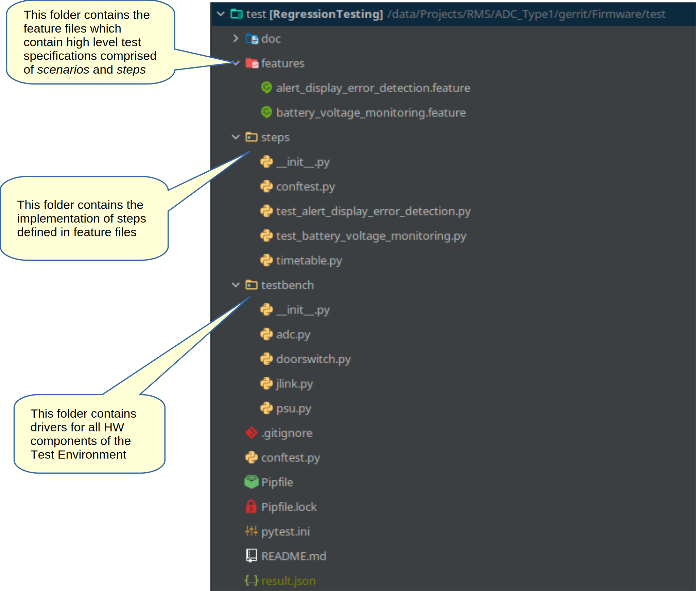

Overview
========

Details tbd

Hardware Configuration
^^^^^^^^^^^^^^^^^^^^^^

The HW Configuration for the Test Environment is shown
in :numref:`fig-testbench-architecture`.

The setup consists of 1 PC which has a modem attached to the SZAS network and a number of testbeds where each
testbed consists of

#. The DUT (ADC Type-1 Board incl. modem)
#. A Power Supply that can be controlled via USB (At the moment the only type supported is the TENMA 72-2710)
#. A Raspberry Pi fitted with a PiFace2 hat that can be accessed by the PC via ssh
#. A Segger J-Link (Ar Atmel SAM-ICE) connected via USB
#. 3 Fixed Load resistors connected to the ADC Type-1 Lantern Port. Suitable resistors are:

   ==================== ==============================
   Lantern              Resistor
   ==================== ==============================
   Left/Right Lantern   Ohmite 825F20RE (20 Ohm / 25W)
   Annulus              Ohmite HS506RF  (6 Ohm / 50W)
   ==================== ==============================

Multiple testbeds can be attached to the PC. If identical testbeds are attached then tests can be distributed to run
on either testbed thus reducing the overall time taken for a regression test run by running tests in parallel.
The testbeds may however also contain variations of the DUT, e.g. one ADC Type-1 board might be equipped with a
Thales PLS62 modem whereas the other DUT might be equipped with a Sierra HL7650 modem - this way FW may be
regression tested with both modems simultaneously. Combinations (e.g. 2x testbeds with modem type A, 1 testbed with
modem type B) are also possible.

.. _fig-testbench-architecture:
.. figure:: Testbench_Architecture.svg
    :align: center

    Testbench Architecture

Test Scripts
^^^^^^^^^^^^

The structure of the source code for the test environment is shown in :numref:`fig-pytest-structure`.
The regression test suite is based on

#. PyTest: https://docs.pytest.org/
#. PyTest-BDD: https://github.com/pytest-dev/pytest-bdd

PyTest is a generic Test Framework for Python. PyTest-BDD is a plug-in for PyTest which supports Cucumber
(https://en.wikipedia.org/wiki/Cucumber_(software)) style BDD (behaviour driven development)

.. _fig-pytest-structure:

    Structure of Test Scripts

.. _fig_feature_example:
.. figure:: feature_example.png
    :align: center

    Example for a Feature File

The test environment after completion of a test-run will print a summary to the console, but will also produce the
file result.json which contains a detailed report in JSON format. There are a number of utilities available to display
the contents of this file, for example the screenshot in :numref:`fig_cucumber_report_example` was produced with
cucumber-html-reporter which is available here: https://www.npmjs.com/package/cucumber-html-reporter

.. _fig_cucumber_report_example:
.. figure:: cucumber_report_example.png
    :align: center

    Example Cucumber Report

